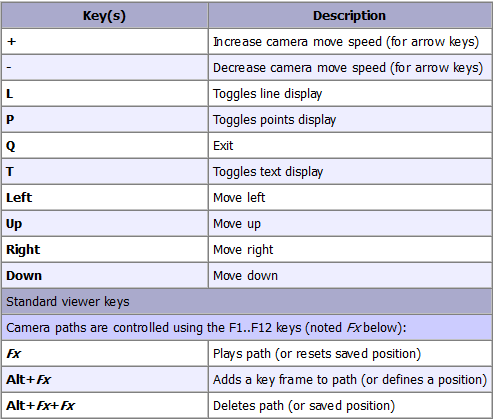
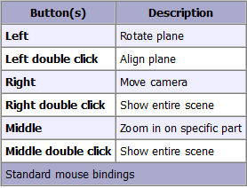

Everything here incorporates the [Trajectory-Hotspots](https://github.com/NHLStenden-ISAL/Trajectory_Hotspots) library
as a submodule. The visualization is based on the algorithms used in the library.

---
## Installation

1. [Download Latest Version](https://github.com/BardoBard/Trajectory-Hotspots-Visualization/releases/latest) and unzip.
2. Add path to your Trajectory.txt with options to the Config.txt file.
3. Run the executable from the unzipped folder and give location of Config.txt file as argument.

---

# Trajectory-Hotspots-Visualization

Visualizes trajectories and their hotspots in 2D.

### Examples:

 

---

# Trajectory-Hotspots-Benchmark

Benchmarking tool for the Trajectory-Hotspots library. The benchmarking tool is

---

## Buttons

Keyboard:

---


Mouse:

---


---

## Clone

clone with submodules

```bash
git clone --recursive -j8 --branch "master" https://github.com/BardoBard/Trajectory-Hotspots-Visualization.git "Visualization"
```

This assumes you have **vcpkg** and **cmake**. If not, follow the instructions on
the [website](https://vcpkg.io/en/getting-started.html).

#### Install:

install might take a while

```bash
vcpkg install qt5
vcpkg install cgal
vcpkg install opengl

vcpkg integrate install
```

## Dependencies

| Dependency | Version      |
|------------|--------------|
| CGAL       | 5.6          |
| CGAL[QT]   | -            |
| OpenGl     | 2022-12-04#3 |
| Nanobench  | 4.3.11       |