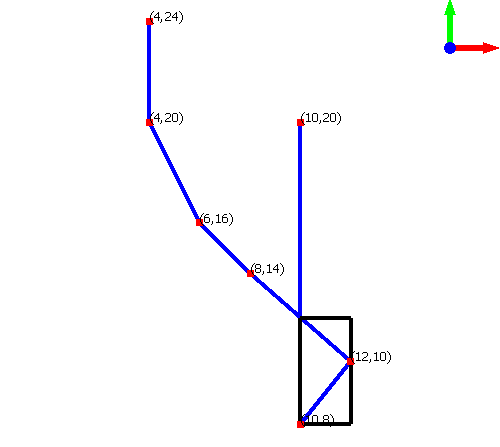

Everything here incorporates the [Trajectory-Hotspots](https://github.com/NHLStenden-ISAL/Trajectory_Hotspots) library
as a submodule. The visualization is based on the algorithms used in the library.

# Trajectory-Hotspots-Visualization

Visualizes trajectories and their hotspots in 2D.

Simple example:



# Trajectory-Hotspots-Benchmark

Benchmarking tool for the Trajectory-Hotspots library. The benchmarking tool is

## Installation

- [Download Latest Version](https://github.com/BardoBard/Trajectory-Hotspots-Visualization/releases/latest) and unzip.
- Add path to your trajectories with options to the Config.txt file.
- Run the executable from the unzipped folder and give location of Config.txt file as argument.

## Buttons

---
| Button     | Usage                          |
|------------|--------------------------------|
| Arrow Keys | Move camera                    |
| T          | Toggle text on/off             |
| MouseWheel | Zoom in/out                    |
| Mouse Drag | Move camera                    |
| +-         | Increase/Decrease Camera speed |
| Esc        | Close application              |
---

## Clone

```bash
# clone with submodules
git clone --recursive -j8 --branch "master" https://github.com/BardoBard/Trajectory-Hotspots-Visualization.git "Visualization"
```

This assumes you have **vcpkg** and **cmake**. If not, follow the instructions on
the [website](https://vcpkg.io/en/getting-started.html).

#### Install:

```bash
# install might take a while
# install x64-windows triplet for 64 bit windows

vcpkg install qt5
vcpkg install cgal
vcpkg install opengl

# integrate vcpkg with visual studio
vcpkg integrate install
```

## Dependencies

- QT5 (5.15.11)
- CGAL (5.6)
- OpenGl (2022-12-04#3)
- Nanobench (4.3.11)