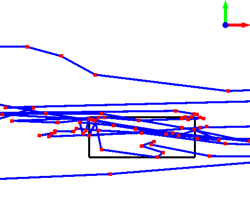

Everything here incorporates the [Trajectory-Hotspots](https://github.com/NHLStenden-ISAL/Trajectory_Hotspots) library
as a submodule. The visualization is based on the algorithms used in the library.

---
---

# Trajectory-Hotspots-Visualization

Visualizes trajectories and their hotspots in 2D.

### Examples:

 

---

# Trajectory-Hotspots-Benchmark

Benchmarking tool for the Trajectory-Hotspots library. The benchmarking tool is

---

## Buttons

Keyboard:

---

Mouse:

---

---

## Dependencies

| Dependency | Version      |
|------------|--------------|
| CGAL       | 5.6          |
| CGAL[QT]   | -            |
| OpenGl     | 2022-12-04#3 |
| Nanobench  | 4.3.11       |